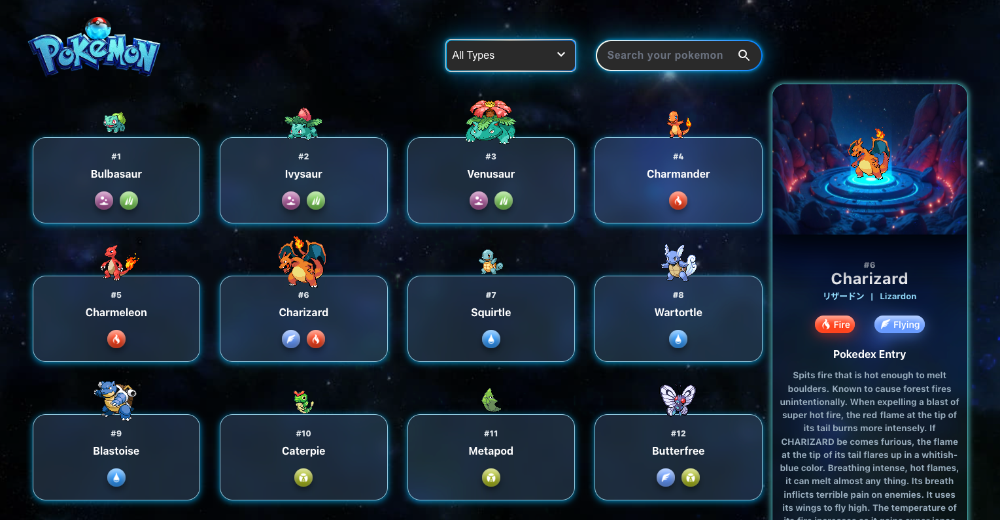

# Pokémon Detail Viewer

## Overview

This project is a Pokémon detail viewer designed with React, Styled Components, and TypeScript. It allows users to view detailed stats and information for each Pokémon in a visually rich, responsive UI. The project includes a list of Pokémon and a detailed view that displays a selected Pokémon's stats, type, evolution path, and additional information.

## Demo

https://pokedex-fs.vercel.app/

## Features

- **Pokémon List View**: Displays a grid of Pokémon, each with its name, type, and index number.
- **Detail View**: Clicking on a Pokémon in the list brings up a detailed view that includes:
  - Pokémon name, ID, and type icon
  - A high-quality Pokémon image and a background that adds depth to the visual experience
  - Detailed stats, including HP, Attack, Defense, Sp. Atk, Sp. Def, and Speed, with total calculation
  - A hexagonal radar chart to represent the Pokémon's stats distribution
  - Evolution chain display (if applicable) for visualizing the Pokémon’s evolutions
- **Interactive Animations**: The UI incorporates animations, making the experience more engaging.

## Technologies Used

- **React**: Component-based UI development
- **TypeScript**: Type-safe programming for enhanced reliability and error-checking
- **Styled Components**: CSS-in-JS for encapsulated and dynamic styling
- **PokeAPI**: Fetches real-time Pokémon data, including stats, type, evolution, and descriptions
- **CSS Animations**: Adds interactivity to elements like the rotating Pokéball

## Installation

1. Clone the repository:
   ```bash
   git clone https://github.com/susantoferry/pokedex.git
   cd pokedex

2. Install dependencies:
    ```bash
    yarn install

3. Running project:
    ```bash
    yarn dev

4. Open your browser and go to http://localhost:5173/

## Key Components

- **`PokemonList`**: Displays a grid layout of Pokémon. Users can select a Pokémon to view more details.
- **`PokemonDetail`**: Renders selected Pokémon's details, including stats, type, description, and evolution chain.
- **`StatChart`**: Uses a hexagonal radar chart to represent Pokémon stats visually.
- **`PokeballWrapper`**: Contains a rotating Pokéball image to add animation and style to the UI.

## API Usage

The project retrieves data from the [PokeAPI](https://pokeapi.co/) to fetch Pokémon details, stats, and evolution information dynamically.

### How It Works

1. **Fetching Pokémon List**: 
   - The application first fetches a list of Pokémon, including basic details like their names and IDs.
   - This data is used to display the Pokémon in a grid view.

2. **Fetching Detailed Information**:
   - When a Pokémon is selected, the app makes an additional API request to fetch in-depth details, such as:
     - **Base Stats**: HP, Attack, Defense, etc.
     - **Type**: Fire, Water, Grass, etc.
     - **Description**: Pokémon-specific information from various games.
   - This information is displayed in the detail view for a selected Pokémon.

3. **Fetching Evolution Chain**:
   - The evolution chain data is fetched to show the Pokémon's evolution path (if available).
   - This includes the stages of evolution, like Charmander → Charmeleon → Charizard.

### Screenshots

<div style="display: flex; justify-content: space-between; gap: 10px;">


</div>
